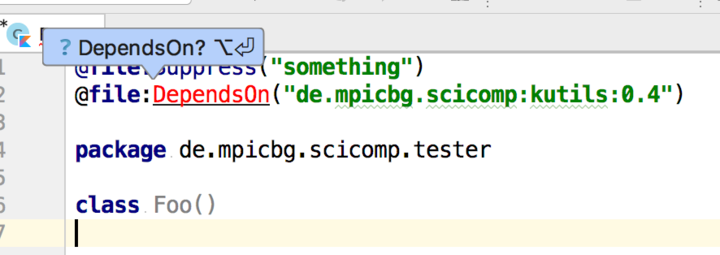

> file annotations have to be on top of everything, just switch places between your annotation and package


But if we do so it does not work above a package statement
```bash
gradle build
```

gives
```
e: /Users/brandl/projects/kotlin/misc/file_pckg_annot/src/main/kotlin/com/foobar/WithPckg.kt: (2, 7): Unresolved reference: MyAnno

FAILURE: Build failed with an exception.

* What went wrong:
Execution failed for task ':compileKotlin'.
> Compilation error. See log for more details

* Try:
Run with --stacktrace option to get the stack trace. Run with --info or --debug option to get more log output.

* Get more help at https://help.gradle.org

BUILD FAILED in 0s
1 actionable task: 1 executed

```


## orignal problem




It seems to work only for stdlb annotations and not for annotations added via classpath. IJ seems aware of the existence because it’s showing an import popup, but there should be no need to import since the `DependsOn` annotation is declared on toplevel as is

This repo contains a SSCE to illustrate the issue.
